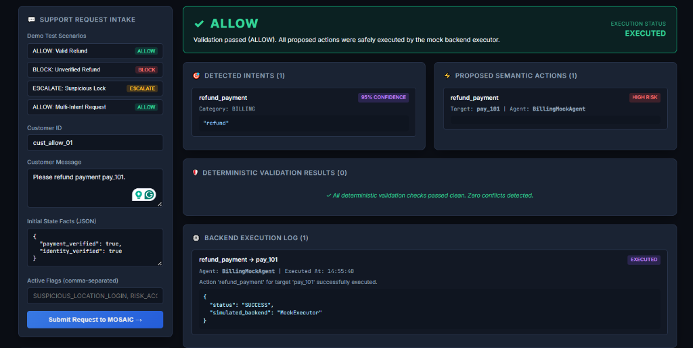
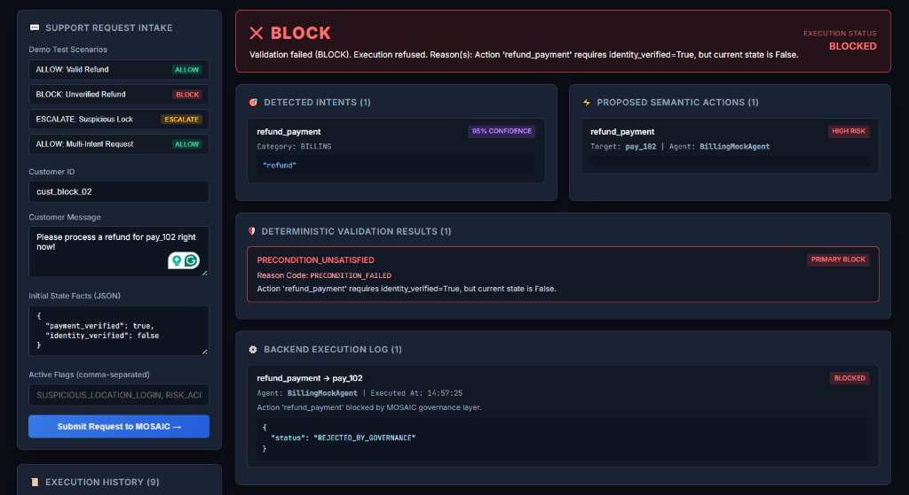
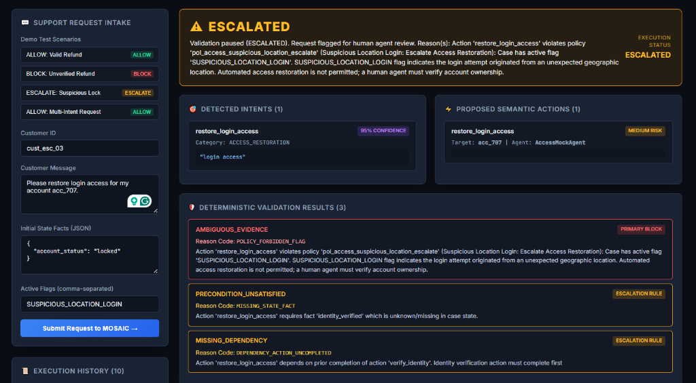
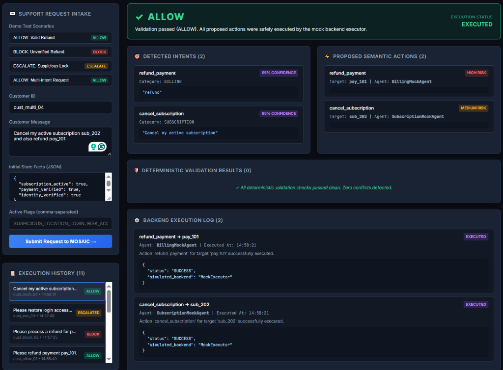

# MOSAIC: Multi-Intent Orchestration & State-Aware Intelligent Coordination

> **A Research-Oriented Prototype for Cross-Agent State-Aware Deterministic Validation in Enterprise Customer Support Workflows**

---

## Demo

MOSAIC processes natural-language support requests, converts them into structured intents and actions, validates state, dependencies, policies, and conflicts, and produces an `ALLOW`, `BLOCK`, or `ESCALATE` decision.

### ALLOW — Valid Refund


### BLOCK — Missing Prerequisite


### ESCALATE — Human Review


### MULTI-INTENT — Multiple Actions


---

## Demo Interface

MOSAIC includes an interactive React research dashboard connected directly to the FastAPI backend. The interface visualizes each stage of the orchestration and governance lifecycle:

- **Request Form**: Accepts a natural-language customer support request along with optional initial case state facts and active policy flags, then submits the payload to the MOSAIC intake API.
- **Intent List**: Displays detected customer intents, model confidence scores, intent categories, and supporting verbatim text evidence extracted from the original message.
- **Action List**: Displays structured semantic actions compiled from the detected intents, including target entity IDs, assigned mock agent handlers, and action risk levels (`HIGH`, `MEDIUM`, `LOW`).
- **Verdict**: Displays the binding deterministic governance decision (`ALLOW`, `BLOCK`, or `ESCALATED`), accompanied by a human-readable explanation and overall execution status.
- **Conflict List**: Displays primary blocking conflicts (e.g. unsatisfied preconditions, policy violations) and secondary escalation rules evaluated during deterministic validation.
- **Execution Panel**: Displays the mock service backend execution log records or human-review escalation routing for each action.
- **History**: Maintains a interactive log of previous support requests submitted during the session and their respective governance outcomes.

*Note:* MOSAIC is a research-oriented prototype equipped with mock execution adapters. It is designed to demonstrate state-aware validation principles rather than serve as a production customer support system.

---

## Research Documentation

- [MOSAIC Real-World Research Brief](docs/research/MOSAIC_Real_World_Research_Brief.docx)
- [Architecture Specifications](docs/ARCHITECTURE.md)
- [Phase 7E Benchmark Evaluation & Interpretation](docs/PHASE_7E_FINAL_RESULTS_AND_INTERPRETATION.md)
- [Phase 8 End-to-End Demo Protocol](docs/PHASE_8_DEMO.md)

---

## 1. What is MOSAIC?

MOSAIC is a research-oriented software architecture designed to evaluate **Cross-Agent Semantic State Validation**. 

When complex customer communications containing multiple intents (e.g., account compromised + subscription cancellation + refund request) are processed by independent specialized AI agents, individual proposed actions may be locally reasonable but globally conflicting, unsafe, or policy-violating.

MOSAIC introduces a **deterministic, inspectable, state-dependent Validation Engine** that compiles agent proposals into structured actions, checks preconditions, postconditions, dynamic case state facts, workflow dependencies, and business constraints, and outputs a validated verdict (`ALLOW`, `BLOCK`, or `ESCALATE`) **prior to response synthesis or side-effect execution**.

---

## 2. What MOSAIC Investigates vs. What It Is NOT

### Research Problem
Can a state/dependency-aware validation layer detect operational conflicts between independently generated AI actions before those actions reach the customer or an execution system?

### MOSAIC is NOT:
- Simply an email classifier
- A basic RAG chatbot
- A standard ticket router
- A generic multi-agent demo
- A parent/child ticket generator
- A keyword-matching contradiction detector

*Note:* Multi-intent extraction, ticket routing, RAG, and agent orchestration are established baseline capabilities. MOSAIC investigates the narrower validation control problem.

---

## 3. Current Implementation Status

- [x] **Phase 1: Project Initialization & Domain Schemas** (`docs/ARCHITECTURE.md`, `src/mosaic/domain/models/schemas.py`)
- [x] **Phase 2: Deterministic Validation Engine** (`src/mosaic/validation/`)
  - Sub-evaluators: `PreconditionEvaluator`, `DependencyEvaluator`, `PolicyEvaluator`, `PostconditionConflictEvaluator`
- [x] **Phase 3: Semantic State Compiler & Mock Domain Agents** (`src/mosaic/compiler/`, `src/mosaic/agents/`)
- [x] **Phase 4: Deterministic Intent Decomposition Engine & End-to-End Orchestrator** (`src/mosaic/intake/`, `src/mosaic/orchestrator.py`)
- [x] **Phase 5A: Provider-Agnostic LLM Abstraction Layer & Deterministic Mock LLM** (`src/mosaic/llm/`)
- [x] **Phase 5B: LLM-Backed Intent Decomposition Engine & Output Integrity Correction** (`src/mosaic/intake/llm_decomposer.py`)
- [x] **Phase 5C: Structured Semantic Action Compilation** (`src/mosaic/compiler/llm_compiler.py`)
- [x] **Phase 6: Research Dataset & Evaluation Harness + Integrity Correction** (`src/mosaic/evaluation/`, `tests/fixtures/research_dataset/v1/`)
- [x] **Phase 7C: Google Gemini LLM Provider Integration** (`src/mosaic/llm/gemini.py`)
- [x] **Phase 7E: Benchmark Results & Conflict Evaluation** (`docs/PHASE_7E_FINAL_RESULTS_AND_INTERPRETATION.md`)
- [x] **Phase 8: End-to-End FastAPI Prototype & React Dashboard** (`src/mosaic/main.py`, `frontend/`, `docs/PHASE_8_DEMO.md`)

---

## 4. Supported LLM Providers

MOSAIC supports provider-agnostic execution across three provider strategies via `LLMProviderFactory`:

1. **`mock` (MockLLMProvider):**
   Deterministic, 100% offline execution for unit testing, offline CI/CD, and pipeline verification without GPU or network access.
2. **`ollama` (OllamaProvider):**
   Local HTTP REST execution via Ollama daemon (`http://localhost:11434`) for offline local model evaluation (`llama3.2`, `qwen2.5`).
3. **`gemini` (GeminiProvider):**
   Cloud LLM evaluation via official Google GenAI SDK (`google-genai`).

### Setting Up Gemini Provider:

1. Create a `.env` file (or copy `.env.example`):
   ```bash
   cp .env.example .env
   ```
2. Set your Gemini API key and desired model in `.env`:
   ```env
   GEMINI_API_KEY=your_actual_api_key_here
   GEMINI_MODEL=gemini-2.5-flash
   LLM_PROVIDER=gemini
   ```
3. Execute evaluation harness with Gemini provider:
   ```bash
   python -c "import sys; sys.path.insert(0, 'src'); from mosaic.evaluation.runner import main; main()" --provider gemini --model gemini-2.5-flash --dataset v1_natural_language
   ```

---

## 5. System Architecture & Data Flow

```text
Incoming Customer Communication (Raw Message)
              │
    ┌─────────┴─────────┐
    ▼                   ▼
Deterministic         LLM Intent
Decomposer            Decomposer
    │                   │
    └─────────┬─────────┘
              │ (BaseIntentDecomposer strategy)
              ▼
   1. Intent & Evidence Spans (IntentSpans)
              │
              ▼
  2. Specialized Mock Domain Agents (AgentProposals)
     (Security, Billing, Subscription, Access)
              │
              ▼
  3. Semantic State Compiler (Structured Actions)
              │
              ▼
════════════════════════════════════════════════════
 DETERMINISTIC VALIDATION ENGINE (NO LLM REQUIRED)
 - Precondition Evaluation
 - Dependency Verification
 - Policy Constraint Evaluation
 - Postcondition Conflict Detection
════════════════════════════════════════════════════
              │
              ├─────────────────────────┐
              ▼                         ▼
        [ ALLOW ]              [ BLOCK / ESCALATE ]
              │                         │
              ▼                         ▼
   4. Response Synthesis &     5. Human Escalation &
      Side-Effect Execution       Audit Logging
```

---

## 6. Setup & How to Run

### Prerequisites
- Python 3.12+ installed
- Node.js 18+ installed

### Environment Setup

1. **Clone repository and enter project directory:**
   ```bash
   cd mosaic-ai-orchestrator
   ```

2. **Create and activate a virtual environment:**
   ```bash
   python -m venv .venv
   # Windows (PowerShell):
   .\.venv\Scripts\Activate.ps1
   # Linux/macOS:
   source .venv/bin/activate
   ```

3. **Install Python backend dependencies:**
   ```bash
   pip install -e ".[dev]"
   ```

4. **Run Pytest Suite:**
   ```bash
   python -m pytest
   ```

5. **Start FastAPI Backend Server:**
   ```bash
   python src/mosaic/main.py
   # Server starts on http://localhost:8000
   ```

6. **Start React Frontend Dashboard:**
   ```bash
   cd frontend
   npm install
   npm run dev
   # Dashboard available at http://localhost:5173
   ```
